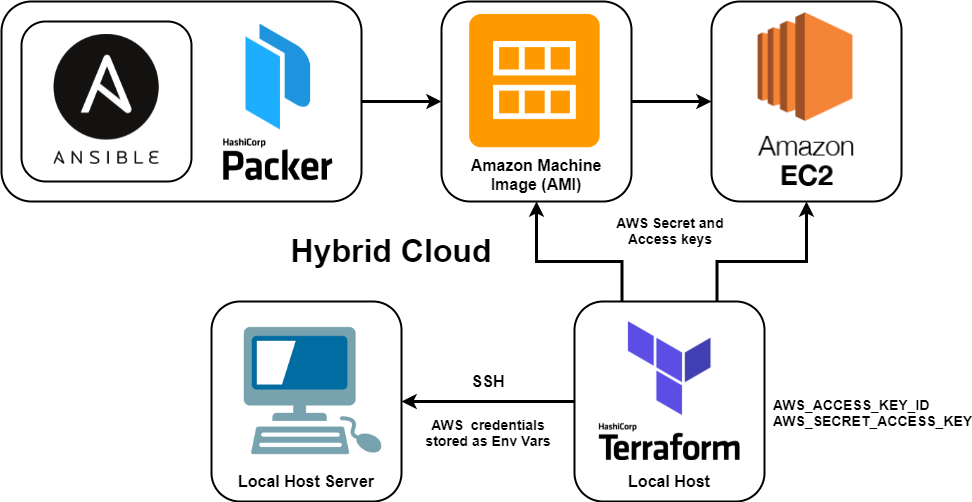

# Orchestration with Terraform
* Terraform is an open-source infrastructure as code software tool that enables you to safely and predictably create, change, and improve infrastructures. 
* Terraform codifies cloud APIs into declarative configuration files. 
* We will use Terraform for the orchestration part of IaC.

## Benefits
* Cloud independent - works with different cloud providers, allowing for multi-cloud configuration 
* Can effectively scale up/down to meet the current load
* Reduced time to provision
* Ease of use
* Concise - a lot of background processes are occurring, more concise than Ansible
* Always keeping up-to-date

## Terraform Diagram


## Most used Terraform Commands
* `terraform init` - initialises Terraform with the dependencies of the provider mentioned in main.tf
* `terraform plan` - checks the syntax of the code and lists the jobs to be done (in main.tf)
* `terraform apply` - launches and executes the tasks in main.tf
* `terraform destroy` - destroys/terminates services running in main.tf

## Terraform to launch an EC2 with a VPC, subnets, SG services of AWS
* The steps involving environment variables are specific to Windows
* Within the coding steps, variables from `variable.tf` will be used

### Step 1: Terraform Installation and Setup
1. Download Terraform for the applicable platform here: https://www.terraform.io/downloads.html
2. Extract and place the **terraform** file in a file location of your choice
3. In Search, type and select `Edit the system environment variables`
4. Click `Environment Variables...`
5. Edit the `Path` variable in `User variables`
6. Click `New`, then add the file path of the **terraform** file inside (e.g. `C:\HashiCorp\Terraform`)
7. Click `Ok` until everything closes

### Step 2: Securing AWS keys with Terraform
1. In Search, type and select `Edit the system environment variables`
2. Click `Environment Variables...`
3. Click `New...` for **User variables**
4. Set the **Variable name** as `AWS_ACCESS_KEY_ID` and add the key as the **Variable value**
5. Repeat steps 3 and 4 for `AWS_SECRET_ACCESS_KEY`
6. Click `Ok` until everything closes
* NOTE: Terraform will look for these keys in the environment variables

### Step 3: Create a VPC
1. First, we have to specify the cloud provider we are using. In this case, AWS.
   ```
   provider "aws" {
     # Define the region to launch the instance (Ireland)
   region = "eu-west-1"
   }
   ```
2. Now, we can add the code to configure our VPC using `aws_vpc`.
   ```
   resource "aws_vpc" "terraform_vpc" {
     cidr_block = "59.59.0.0/16"
     instance_tenancy = "default"
    
     tags = {
       Name = var.aws_vpc_name
     }
   }
   ``` 

### Step 4: Create and Assign an Internet Gateway
To do this, we will use `aws_internet_gateway`.
```
resource "aws_internet_gateway" "terraform_ig" {
  vpc_id = aws_vpc.terraform_vpc.id

  tags = {
    Name = "eng84_william_terraform_ig"
  }
}
```

### Step 5: Create and Assign a Subnet to the VPC
To do this, we will use `aws_subnet`. This will be our public subnet.
```
resource "aws_subnet" "public_subnet" {
  vpc_id = aws_vpc.terraform_vpc.id
  cidr_block = "59.59.1.0/24"

  map_public_ip_on_launch = true # Make it a public subnet
  availability_zone = "eu-west-1c"

  tags = {
    Name = var.aws_subnet_name
  }
}
```

### Step 6: Route Table
To do this, we will use `aws_route_table`. This will be our public route table, which will allow network traffic from the internet.
```
resource "aws_route_table" "terraform_public_rt" {
  vpc_id = aws_vpc.terraform_vpc.id

  route {
    cidr_block = "0.0.0.0/0"
    gateway_id = aws_internet_gateway.terraform_ig.id
  }

  tags = {
    Name = "eng84_william_terraform_public_rt"
  }
}
```

### Step 7: Subnet Association for the Route Table
To do this, we will use `aws_route_table_association`. This will associate the public subnet with the public route table.
```
resource "aws_route_table_association" "public_subnet_assoc" {
  subnet_id      = aws_subnet.public_subnet.id
  route_table_id = aws_route_table.terraform_public_rt.id
}
```

### Step 8: Security Groups
To do this, we will use `aws_security_group`. This defines the inbound and outbound network traffic rules at an EC2 instance level.
```
resource "aws_security_group" "terraform_webapp_sg" {
  name = "eng84_william_terraform_web_sg"
  description = "Security group for the webapp spun-up from Terraform"
  vpc_id = aws_vpc.terraform_vpc.id

  # Inbound rules
  ingress {
    from_port = "80"
    to_port = "80"
    protocol = "tcp"
    cidr_blocks = ["0.0.0.0/0"]
    description = "Allow access from the browser"
  }

  # Outbound rules
  egress {
    from_port = 0
    to_port = 0
    protocol = "-1" # All traffic
    cidr_blocks = ["0.0.0.0/0"]
    description = "Allow all traffic out"
  }

  tags = {
    Name = "eng84_william_terraform_web_sg"
  }
}
```

### Step 9: Creating an EC2 Instance from an AMI
To do this, we will use `aws_instance`. This will create the web app by using it's AMI.
```
resource "aws_instance" "web_app_instance" {
  ami = var.webapp_ami_id
  instance_type = "t2.micro"
  associate_public_ip_address = true

  key_name = var.aws_key_name
  subnet_id = aws_subnet.public_subnet.id

  # Security group
  vpc_security_group_ids = [aws_security_group.terraform_webapp_sg.id]
   
  tags = {
    Name = var.webapp_name
  }
}
```

### Step 10: Running the Web App
The following code needs to be placed in the `aws_instance` code block. This will effectively copy the provision file (`init.sh`) into the web app and run the provision file. The provision file will then execute commands to run the web app automatically.
```
# Move the provisions from local machine to the instance
provisioner "file" {
  # Location of file on local machine
  source = "scripts/app/init.sh"

  # Location to place in the web app
  destination = "/home/ubuntu/init.sh"
}
  
# Allow it to be executable and run it
provisioner "remote-exec" {
  inline = [
    "chmod +x /home/ubuntu/init.sh",
    "sudo /home/ubuntu/init.sh"
  ]
}
  
# Establish the cnnection for provisioning
connection {
  user        = "ubuntu"
  private_key = file(var.aws_key_path)
  host        = aws_instance.web_app_instance.public_ip
}
```
